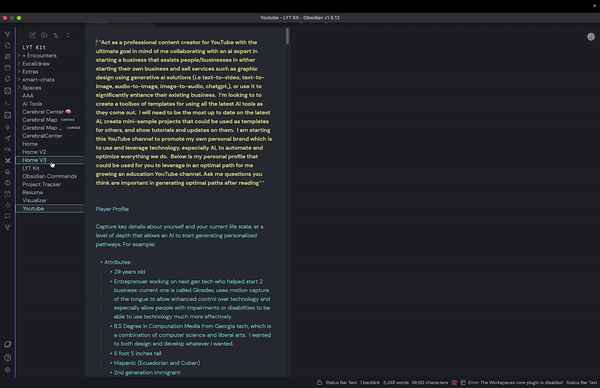
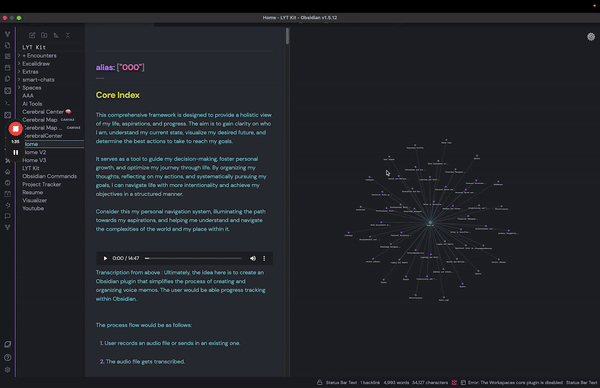
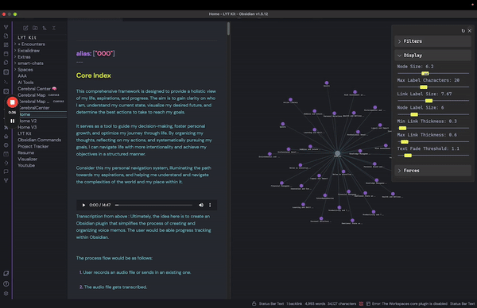
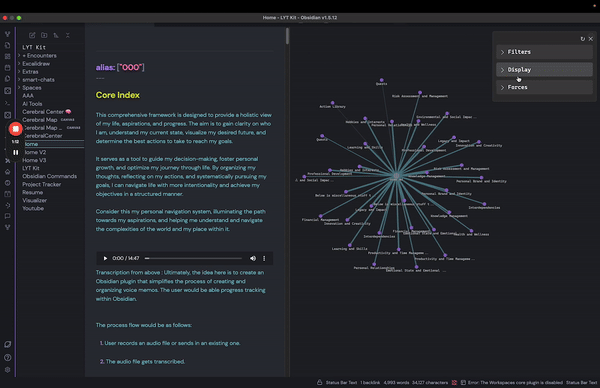

# Smart Connections Visualizer `v1.0`

Welcome to the Smart Connections Visualizer Plugin! This plugin integrates seamlessly with the Smart Connections tool, offering an advanced, interactive way to visualize connections between your notes. My goal is to enhance your ability to discover relationships and insights within your notes, transforming the way you interact with and understand your information. 

[Watch the Demo](https://www.youtube.com/watch?v=dbFRyJBkxS0)

[Install Smart Connections Visualizer](https://obsidian.md/plugins?id=smart-connections-visualizer)

## UPDATE

This displays connections for a single note.  If you've like to visualize clusters between multiple notes or all within your entire vault, check out [Smart Connections Vault Visualizer](https://github.com/Mossy1022/Smart-Connections-Vault-Visualizer)

## Features

- **Dynamic Force-Directed Graph:** Visualize connections as a force-directed graph where nodes represent notes or specific excerpts from them and edges represent connections.  
- **Easily view more relevant connections:** The distances between nodes and the central node (currently viewed note) are proportional to the relevance of the connections.  The closer the distance to the main node, the more relevant the connection is.  You can also adjust min and mx width of links to better distinguish these notes/blocks based on relevance.
- **Adjustable Visualization Settings:** Customize node size, label size, and text fade distance and more to tailor the visualization to your preferences.
- **Previewing Notes:** Ability to see note previews in the visualization view when hovering over a node.
- **Customizable Forces:** Adjust the repel force, link force, and center force for a more personalized layout.

## Installation

Getting started with the Smart Connections Visualizer Plugin is easy. Follow these steps to install and integrate it with your Smart Connections setup:

1. **Install & Configure Smart Connections Plugin:** Ensure you have the Smart Connections plugin installed and all set up in your Obsidian environment.
2. **Install Smart Connections Visualizer Plugin:** Download and install the Smart Connections Visualizer Plugin from the Obsidian Community Plugins.

## Usage

Once installed, the Smart Connections Visualizer Plugin provides an intuitive interface to explore your notes' connections.

### Opening the Visualizer

To open the Visualizer View:

1. Select the ribbon icon to the left that will display "Smart Connections Visualizer"
2. The visualization pane will appear.
3. Select a note and you'll see a dynamic force-directed graph of that note and its connections displayed.

### Interacting with the Visualization

- **Zooming:** Use the mouse wheel or touchpad to zoom in and out of the view.
- **Panning:** Click and drag the visualization to move it around.
- **Hovering:** Hover over nodes to highlight them - displaying the full node label and link label, which right now the link label displays the relevance score.
- **Previewing Notes:** When hovering over a node, press the `Ctrl` (`Command` for Mac) key to view a preview of the note or block that the node represents.

### Customizing the Visualization

Access the settings menu by clicking the gear icon in the top right corner of the visualization pane. Here, you can adjust various parameters:

- **Minimum Relevance**: Adjust the slider to change the minimum relevance score needed for displaying connections.
- **Connection Type**: Choose whether to display connections by block, or by note.
- **Node Size**: Change the size of the nodes to make them more visible or to declutter the visualization.
- **Maximum Label Characters**: Define the maximum number of characters displayed on node labels before they truncate/are shortened. Note: hovering over a node will display the full node label.
- **Minimum Link Thickness**: Set the minimum thickness for the links. Helps to distinguish between less relevant connections.
- **Maximum Link Thickness**: Set the maximum thickness for the links. Helps to distinguish between less relevant connections.
- **Link Label Size**: Change the font size of the link labels. Note: Link label will display when hovering over a node.
- **Node Label Size**: Adjust the font size of the node labels.
- **Text Fade Threshold**: Set the zoom level at which labels fade in and out.
- **Repel Force**: Adjust the force that pushes nodes apart.
- **Link Force**: Modify the strength of the links between nodes.
- **Link Distance**: Adjust the distance between connected nodes - relevance distance will increase/decrease proportionally.

  
  

## Vision

The text communication format between humans and AI (including other humans) is **incredibly** inefficient. I believe data visualization tools like this will not only exponentially enhance our ability to communicate with AI but also create a new discovery and decision-making process that will transform how we approach virtually everything. Our brains can't physically retain all the information and use logic to solve our more complex problems simultaneously. Having all the information in the form of text that's neatly scattered across different notes and folders helps, but is nowhere near sufficient. We need to offload this information into a visualization to save our progress and pick up where we left off.  

Imagine solving a Sudoku puzzle without a board. That's what we're doing right now when communicating, arguing, and solving problems. You have to memorize all the factors in the starting position, all the moves you make, all the relationships that change with every single move, and so on..  For the complex problems/puzzles we have in life, imagine the difference in our ability to solve them WITH the board. The puzzle is there– we just haven't made the board for it yet!

With this plugin, I envision a future where note-taking, whether text or voice, doesn't get lost. I struggle with maintaining a strict note-taking structure, and things often fall through the cracks. This challenge, combined with my obsession, drives me to create this plugin. While it's not perfect yet, it's a promising start and could improve significantly with your help :) I can hear the music.. and I'm excited to see who else can too!

The ultimate mission is to move away from text-based organization and instead visualize information in a dynamic, context-driven state. As you add more notes, the state updates in a single visualization, showing how new information impacts the old through various relationships (e.g., supportive vs. contradictory statements). This approach eliminates the need for separate folders, as everything is interconnected and builds on top of each other.

I believe this will also solve the "hallucination" problem with AI. By using a visualization as the saved state/knowledge base/memory, we ensure the AI always has the correct context that both you and the AI have worked on and, importantly, that **you** have approved.

The goal is to see everything you couldn't see before and observe how updating information cascades and affects all other connections. We're on the brink of exponentially increased problem-solving capabilities through visualizing our text-based information, and the possibilities are endless! I've been dedicating a lot of time to this project alongside my other jobs, so any support would be greatly appreciated to allow me more time to keep going :) 

## About Me

Hello there! Name's Evan :D 

I'm a senior software developer/architect consultant, currently managing and developing data visualization tools for the CDC.  I've been obsessed about what's transpiring with AI for the last 12-ish years, fully aware that it would soon completely change the world.

Inspired by Brian, the creator of Smart Connections, I started an AI consulting company called "Evan's Oasis." At Evan's Oasis, I audit business workflows for clients and recommend AI tools and practices that significantly enhance decision-making, productivity, and quality—while reducing the time and money needed to run a business.

I've been actively sharing my knowledge by giving webinars to both General Dynamics and the CDC on the most significant AI updates, as well as hosting in-person seminars for the local community. One of my life's main questlines is to inspire people to take advantage of the outragoues new capabilities we have with AI and to show how these tools can assist us in our everyday lives. 

TLDR: I was born for this.

In addition to my passion for AI, I'm also developing a device that allows people to control technology using motion capture of their tongue—effectively giving us a fifth limb for universal, hands-free remote control. And don't worry, you won't be moving your tongue around with your mouth open; you can keep your mouth completely closed, and it looks like mind control. We're hoping this device will do wonders for those with physical limitations who can't use technology as effectively. We are currently in the funding phase but have developed several functional prototypes. You can find out more at [Glosdex.com](https://glosdex.com/) 

## Community and Support

Your involvement is crucial to the evolution of Smart Connections Visualizer. From troubleshooting issues to suggesting new features, every contribution enriches our community and drives the project forward! 

### Join The Community

- **GitHub Discussions**: Participate in discussions on GitHub to share your experiences and ask questions.
- **Contribute**: Help develop the plugin, report issues, or suggest new features.
- **User Testimonials**: Share how the plugin has impacted your workflow and creativity.

## Acknowledgements

Special thanks to Brian, the developer behind [Smart Connections](https://github.com/brianpetro/obsidian-smart-connections). 

## License

The Smart Connections Visualization Plugin is open-source and available under the MIT License. Contributions are welcome!

---

Feel free to reach out with any questions or suggestions. I hope this plugin enhances your note-taking experience and helps you uncover new insights and connections within your notes. Happy visualizing!
